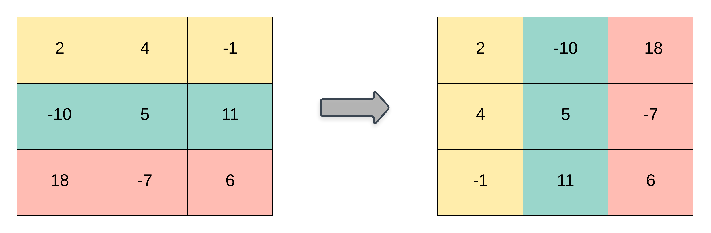

На вхід подається 2D список з цілих чисел - `matrix`, поверни _**транспоновану**_ матрицю `matrix`.

**Транспонована** матриця - це матриця, перевернута через головну діагональ, зі зміною індексів рядків і стовпців матриці.


**_Приклади_**:
```python
Input: matrix = [[1, 2, 3], [4, 5, 6], [7, 8, 9]]
Output: [[1, 4, 7], [2, 5, 8], [3, 6, 9]]

Input: matrix = [[1, 2, 3], [4, 5, 6]]
Output: [[1, 4], [2, 5], [3, 6]]
```
---
**_Обмеження_**:
- `m` == `len(matrix)`
- `n` == `len(matrix[i])`
- 1 <= `m`, `n` <= 1000
- 1 <= `m` * `n` <= 105
- 109 <= `matrix[i][j]` <= 109